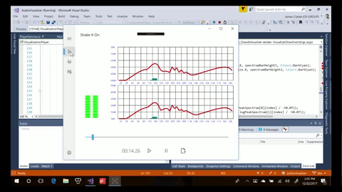

# Build status
 

## Build status

| Target | Branch | Status | Recommended Nuget packages version |
| ------ | ------ | ------ | ------ |
| Current Release | master | [](https://ci.appveyor.com/api/projects/status/p4a7jmpa9391bxu8/branch/master?svg=true) | [](https://www.nuget.org/packages/UWPAudioVisualizer/) |

# Introduction



The AudioAnalyzer UWP extension DLL contains a MF component and companion XAML controls that can provide realtime audio analysis information for visualization and other purposes. The library contains prebuilt controls implementing VU meters, a spectrum analyzer as well as a control that has a custom draw capability.  This project is a continuation of the work [here](https://github.com/clarkezone/audiovisualization) and originally [here](https://github.com/robmikh/audiovisualization).

To play with a demo app the shows the controls in action, grab [this app from the Windows Store](https://www.microsoft.com/en-us/p/audio-spectrum-visualizer/9nfrlr613699?activetab=pivot:overviewtab).

## What's new
A large refactor has just made it's way to Master.  This moves the native library from WRL onto C++/WinRT resulting in a drastic simplification of the COM boilerplate. Compared to the initial beta release there are also some further improvements.

### Version 1.0.7

[](http://www.youtube.com/watch?v=nS0scXYIGhU "")

_(click image to play video)_

* You can now insert analyzer both into MediaPlayer and AudioGraph pipeline
* [AudioAnalyzer](wiki/AudioAnalyzer.md) itself is exposed so you can use it to generate data on audio frames from file as an example
* There is a new data source [SourceConverter](wiki/SourceConverter.md) that helps reshaping the visualization data and applying physics (combine channels, convert spectrum to logarithmic scale, apply rise and fall times)
* There are 4 customizable built-in controls to display visualization
  * [AnalogVUMeter](wiki/AnalogVUMeter.md) mimics an analog VU meter with a scale and dial and takes input from RMS
  * [DiscreteVUBar](wiki/DiscreteVUBar.md) is a stacked bar of elements that lit up based on RMS and Peak data 
  * [SpectrumVisualizer](wiki/SpectrumVisualizer.md) is a multicolumn stacked bar of elements that take input from the spectrum data
  * [CustomVisualizer](wiki/CustomVisualizer.md) is a Win2D custom draw control that allows to draw the visualization frame by frame


To learn more browse the [documentation](wiki/AudioVisualizer.md)

# Getting started
## Installing the library
Download and install the AudioAnalyzer [nuget package](https://www.nuget.org/packages/UWPAudioVisualizer/).  Note this will also add a reference to Win2D to your project.

```
Install-Package UWPAudioVisualizer
```

for convenient use add namespace statement to your C# code as:

```csharp
using AudioVisualizer;
```

add namespace statement and built in controls to your XAML code as:
```
<Page
    x:Class="App4.MainPage"
    xmlns="http://schemas.microsoft.com/winfx/2006/xaml/presentation"
    xmlns:x="http://schemas.microsoft.com/winfx/2006/xaml"
    xmlns:d="http://schemas.microsoft.com/expression/blend/2008"
    xmlns:mc="http://schemas.openxmlformats.org/markup-compatibility/2006"
    xmlns:visualizer="using:AudioVisualizer"
    mc:Ignorable="d">

    <Grid>
        <StackPanel>
            <visualizer:DiscreteVUBar />
            <visualizer:CustomVisualizer />
        </StackPanel>
    </Grid>
</Page>

```
## Initializing the source
First you need to create the analyzer object, that implements [IVisualizationSource](VisualizationSource.md) interface which is basis to retrieve audio data.

To create visualization source you need to create PlaybackSource, you can create this from MediaPlayer or from [AudioNode](https://docs.microsoft.com/en-us/uwp/api/windows.media.audio.iaudionode
) or [MediaPlayer](https://docs.microsoft.com/en-us/uwp/api/Windows.Media.Playback.MediaPlayer). With AudioNode the source will be available immediately however for MediaPlayer it will be created only when MediaPlayer will open source and start playing. When opening a new file a new source will be created - this means that if you use PlaybackSource with MediaPlayer you will need to monitor the SourceChanged event and assign the new source to the controls you are using.

    partial class VisualizationPage : Page
    {
        MediaPlayer _player;
        AudioVisualizer.PlaybackSource _source;

        public VisualizationPage()
        {
            _player = new MediaPlayer();
            _source = new PlaybackSource.CreateFromMediaPlayer(_player);
            _source.SourceChanged += Playback_SourceChanged;
		}

		private void Playback_SourceChanged(object sender, IVisualizationSource source)
        {
			vuMeter.Source = source;
			spectrumDisplay.Source = source;
			playPositionDisplay.Source = source;
        }

		private void Page_Loaded(object sender, RoutedEventArgs e)
        {
			vuMeter.Source = _source.VisualizationSource;
			spectrumDisplay.Source = _source.VisualizationSource;
			playPositionDisplay.Source = _source.VisualizationSource;
        }
   }

## Getting the data
Once you have a properly initialized [IVisualizationSource](VisualizationSource.md) you get the 
visualization data by calling GetData(). This method will return [VisualizationDataFrame](VisualizationDataFrame.md) 
for the current audio being played or null if the current state of stream is stopped or if the analyzer is catching up processing 
for example due to seek operation.
All controls have a source property, once you assign the source to the controls, they will pull and display data automatically.