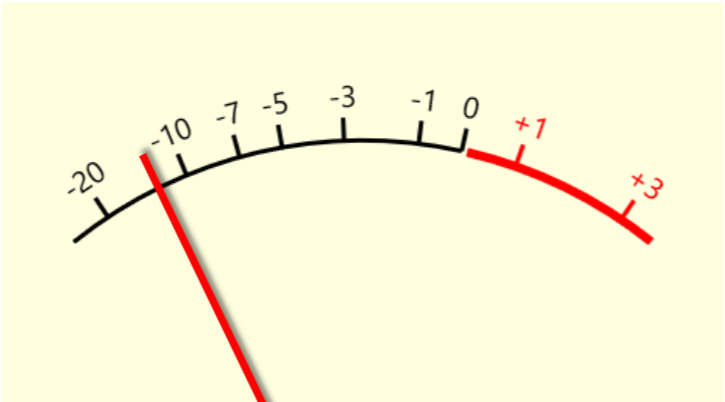

# AnalogVUMeter
Mimics the appearance and function of an analog meter.

## Interfaces
Interface1, Interface2
## Methods
### Method1()
Method 
#### Parameters
##### ParameterName (type)
Description
##### Returns
**type**
Description
#### Examples
#### Remarks
Remarks here
#### See also
[Link](Link)
## Properties
### Property 1
Property description
#### PropertyName (type)
Additional Description
#### Remarks
Remarks here
#### See also
[Link](Link)
### Property 2
Property description
#### PropertyName (type)
Additional Description
#### Remarks
Remarks here
#### See also
[Link](Link)
## Events
### Event 1
Description
#### Remarks
Remark text here
